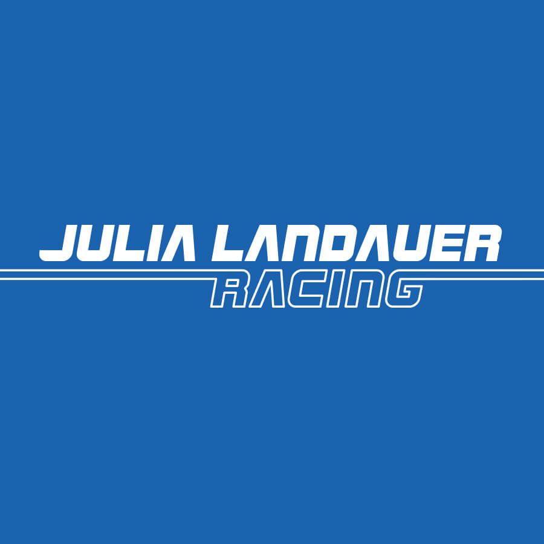
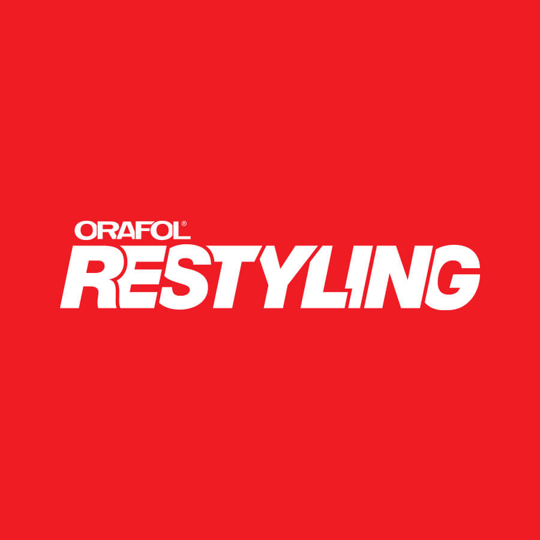

<section id="one">
    

        <header class="major">
            <h2>My name is Nate Holland</h2>
        </header>
        

            

                
I'm a Senior Developer and I specialize in front-end development and design of eCommerce websites. My daily responsibilities often include creating functional interfaces from design comps, QA’ing fellow developers code, interacting with clients, and assisting with training of Jr. Developers. My formal background in design is backed by 3+ years of front-end development, which has given me a wide range of experiences. Including, but not limited to Magento, Shopify Plus, and Wordpress, as well as various other platforms and development languages.

            

            

                
I’ve worked in teams and led teams of developers, utilized tools like Gulp, Grunt, and Node to streamline development and build tasks, all while maintaining clean project repos with Git. I've also worked with Web and SQL database servers, including upkeep, provisioning, and maintenance, which has made me quite comfortable working in command line environments as well.

            

        

    

</section>

<section id="two" class="spotlights">
    <section>
        
        

            

                

                    

                        <header class="major">
                            <h3>Julia Landauer Racing</h3>
                        </header>
                        
Julia Landauer is the first female Nascar driver from New York City as well as a Stanford University graduate, and businesswoman. I designed her brand identity, including the logo, stationery, website, hero card, electronic press kit, and social networking pages....

                        <ul class="actions">
                            <li><a href="/2017/09/01/julia-landauer-racing.html" class="button">See More</a></li>
                        </ul>
                    

                

            

        

    </section>

    <section>
        
        

            

                

                    

                        <header class="major">
                            <h3>Askderm</h3>
                        </header>
                        
Askderm is a cosmetics supply company that manages a number of sub-brands. My primary role in this project at Gauge was on the front-end development team, as well as consulting on Design &amp; UX throughout...

                        <ul class="actions">
                            <li><a href="/2017/05/17/askderm.html" class="button">See More</a></li>
                        </ul>
                    

                

            

        

    </section>

    <section>
        
        

            

                

                    

                        <header class="major">
                            <h3>Orafol Restyling</h3>
                        </header>
                        
Orafol Restyling is a division of it’s parent company Orafol. Restyling specializes in producing high quality vehicle wraps from Orafol materials. With several different lines of wrap and multiple colors per line, they needed a way to showcase their existing product...

                        <ul class="actions">
                            <li><a href="/2017/04/01/orafol.html" class="button">See More</a></li>
                        </ul>
                    

                

            

        

    </section>
    <section>
        
        

            

                

                    

                        <header class="major">
                            <h3>Chess House</h3>
                        </header>
                        
I had the opportunity to lead the development of a Volusion to Shopify project at Gauge for a long-time family business based in Washington, Chess House. This project involved some highly technical aspects...

                        <ul class="actions">
                            <li><a href="/2017/03/01/chesshouse.html" class="button">See More</a></li>
                        </ul>
                    

                

            

        

    </section>
    
</section>

